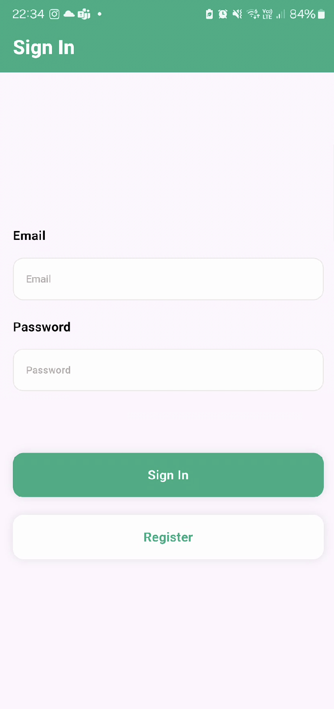
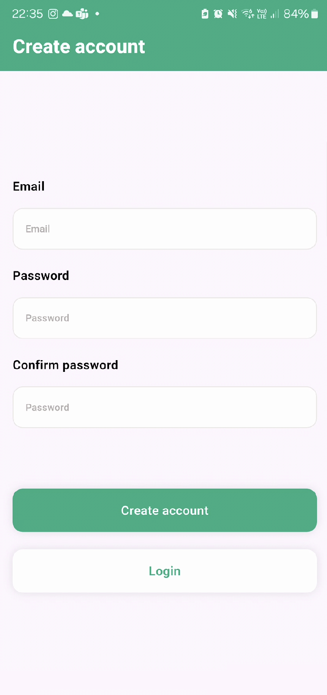
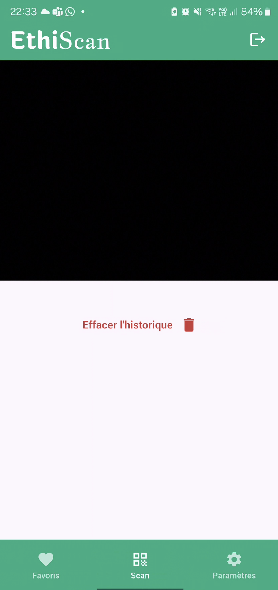
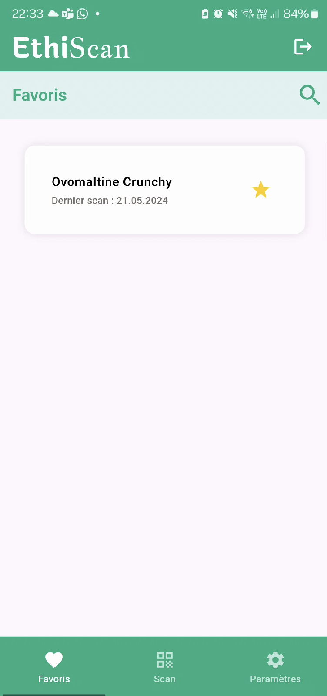
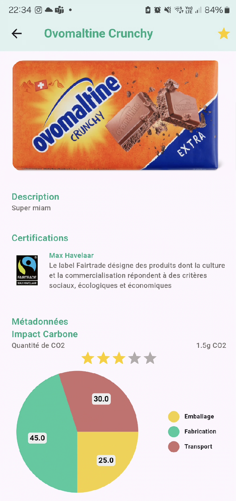
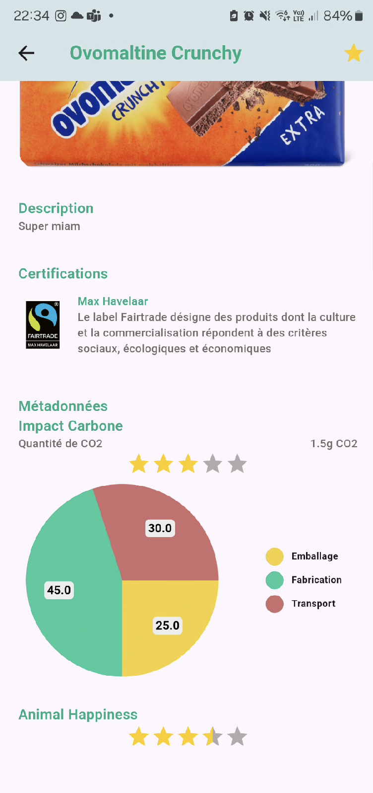
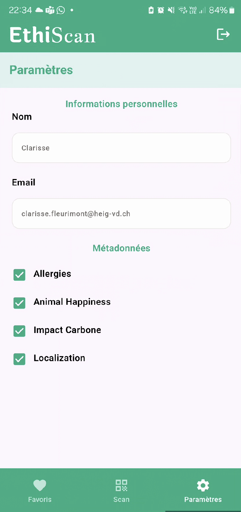
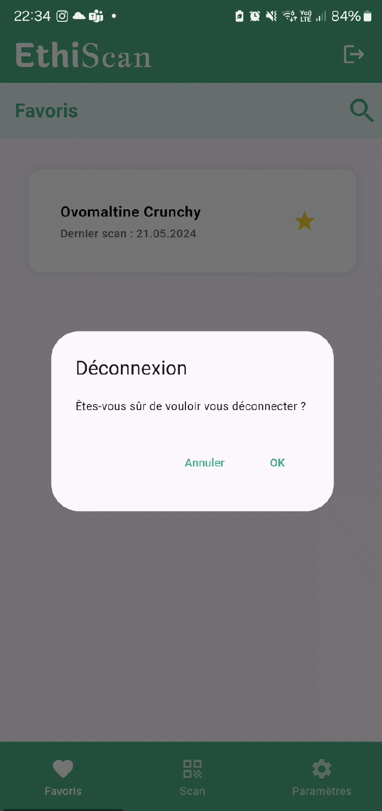

# EthiScan - frontend
[](https://github.com/MA-AdMoApp-EthiScan/frontend/actions/workflows/continuousDeployment.yaml)
[](https://github.com/MA-AdMoApp-EthiScan/frontend/actions/workflows/super-linter.yaml)

Le projet de AdMoApp au master MSE

## Clean Architecture

<https://isaiascuvula.medium.com/flutter-clean-architecture-2837583ed5c0>

## Repositories

- [Frontend (current)](https://github.com/MA-AdMoApp-EthiScan/frontend)
- [Backend](https://github.com/MA-AdMoApp-EthiScan/backend)
- [Concept](https://github.com/MA-AdMoApp-EthiScan/concept)

## Technologies
- Flutter (Dart) :
```
Flutter 3.22.0 • channel stable • https://github.com/flutter/flutter.git
Framework • revision 5dcb86f68f (12 days ago) • 2024-05-09 07:39:20 -0500
Engine • revision f6344b75dc
Tools • Dart 3.4.0 • DevTools 2.34.3
```
- Firebase
- Google Scanning API (for the MVP) : `google_mlkit_barcode_scanning: ^0.12.0`

## Getting Started

1. Clone the repository
2. Run the `start_app.sh` script (use the `--help` flag for more information)
3. Open the project in your IDE
4. Run the app


## Manuel Utilisateur Ethiscan

Bienvenue sur Ethiscan, une application conçue pour vous aider à suivre et évaluer l'impact éthique et durable des produits que vous achetez.

### Premiers Pas

#### Connexion et Création de Compte

##### Se Connecter

Pour accéder à votre compte, entrez votre email et mot de passe puis appuyez sur "Se Connecter".



##### Créer un Compte

Pour créer un nouveau compte, appuyez sur "S'inscrire" sur la page de connexion, entrez votre email, définissez un mot de passe, confirmez votre mot de passe, et appuyez sur "Créer compte".



### Fonctionnalités Principales

#### Scanner des Produits

Appuyez sur l'icône "Scanner" pour commencer à scanner des produits. Orientez votre caméra vers un code-barres produit pour voir des informations détaillées.



#### Favoris

- **Voir les Favoris**: Appuyez sur l'icône "Favoris" pour voir les produits que vous avez marqués comme favoris.
- **Ajouter aux Favoris**: Pendant que vous consultez un produit, appuyez sur l'icône étoile pour l'ajouter à vos favoris.



#### Détails du Produit

Chaque page de produit affiche le nom du produit, une brève description, et une évaluation par étoiles de la note éthique globale.

- **Certifications**: Les certifications telles que "Fairtrade" sont affichées pour indiquer la conformité aux normes éthiques diverses.
- **Impact Carbone**: Un graphique circulaire montre la répartition de l'empreinte carbone du produit, de l'emballage, la fabrication, et le transport.
- **Bonheur Animal**: L'évaluation par étoiles sous "Bonheur Animal" indique à quel point le produit est respectueux des animaux.




### Paramètres et Personnalisation

- **Accéder aux Paramètres**: Appuyez sur l'icône "Paramètres".
- **Informations Personnelles**: Mettez à jour votre nom et email.
- **Préférences de Métadonnées**: Personnalisez les métadonnées que vous souhaitez suivre, telles que les allergies, le bonheur animal, l'impact carbone, etc.



### Options Supplémentaires

- **Déconnexion**: Pour vous déconnecter appuyez sur le bouton de déconnexion, puis confirmez en sélectionnant "OK".
- **Effacer l'Histoire**: Sous les paramètres, vous pouvez trouver l'option pour effacer votre historique de scan.


